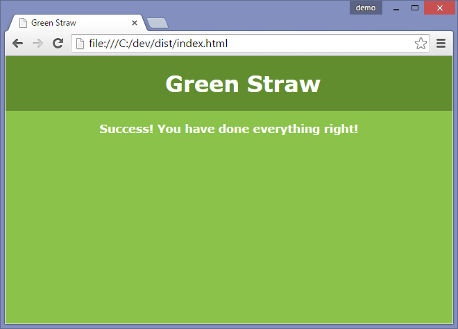

# Gulp-Jade-Stylus Starter Project

### Info
This is an incredibly basic starter project, to get up and running for quick hacks and other things.

I'm using [gulp](https://gulpjs.com) for build and automation
[jade](https://jade-lang.com) for the pages and [stylus](https://learnboost.github.io/stylus/) for the css

### Getting Started

0. Clone this repo:  
```
git clone --depth 1 --origin source https://github.com/thunsaker/green-straw
```
1. `npm init` to change default project values
2. `npm install` dev dependencies
3. `gulp` to build it or `gulp watch` for continuous building
4. Open "dist/index.html" in your browser of choice

You should see something like this:


Open your favorite text editor (I like [atom](https://atom.io)) and hack away!.
